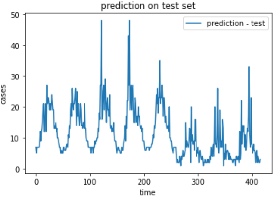

## Take-home assessment

Constellation 

Author: Haochen Xie

# 1. Introduction

This Repo contains the source codes, notebooks and other documentation I created for DengAI: Predicting Disease Spread (https://www.drivendata.org/competitions/44/dengai-predicting-disease-spread/) as part of Constellation take-home assessment.

This competition aims to predict the cases of dengue fever in San Juan and Iquitos. The training data set contains time sequence records from 2003 to 2008. The test data contains time sequence records from 2008 to 2013. Thus, the goal of the model is to predict future dengue cases based on historical information.

In this readme file, I will walk through the following contents:

1. An overview of the repo structure
2. Key takeaways from exploratory data analysis
3. A high-level summary of the feature engineering and data argumentation steps I explored
4. A high-level summary of how I iterate my modeling approaches to receive a **top 3%** rank in this competition (by 11/9/2022)


# 2. Overview of the Repo Structure

```
root
|	README.md
|
|___src
|	|	_helper_class.py
|	|	helper_functions.py
|
|___notebook
|	|	1. Exploration Data Analysis.ipynb
|	|	2. Baseline Models.ipynb
|	|	3. Data Process, Feature Engineering and Enhancement.ipynb
|	|	4. One Stage Modeling Approaches with Stacking.ipynb
|	|	5. Two Stages Modeling Approaches with Stack.ipynb
|	|	Appendix - LSTM Trial 1.ipynb
|	|	Appendix - LSTM Trial 2.ipynb
|	|	Appendix - MLP Trial 1.ipynb
|	|
|	|___archieve
|	|	|	archieved notebook
|
|___images (images for all MD files)

```

- `/src/_helper_class.py`
  - This python script contains the all the classes I used in data pipeline and model pipeline
- `/src/helper_functions.py`
  - This python script contains the wrapper functions I used to explore different modeling approaches
- `/notebook/1. Exploration Data Analysis.ipynb`
  - The notebook for EDA results
- `/notebook/2.Baseline Models.ipynb`
  - The notebook for baseline model creation
- `/notebook/3. Data Process, Feature Engineering and Enhancement.ipynb`
  - This notebook introduces the data process, feature engineering and enhancement classes I developed for the data pipeline.
- `/notebook/4. One Stage Modeling Approaches with Stacking.ipynb`
  - In this notebook, One stage model was created. Stacking was applied to stack the predictions of four  different one-staged models together weighted by each model's cross-validation score.
- `/notebook/5.Two Stages Modeling Approaches with Stack.ipynb`
  - In this notebook, two-staged model was created. Stacking was applied. More details of this modeling approach will be explained in the later section
- `/notebook/Appendix - LSTM Trial 1.ipynb`
  - In this notebook, I treated the dengue cases as time sequence data and modeled this sequence using LSTM. However, the results are below expectation
- `/notebook/Appendix - LSTM Trial 2.ipynb`
  - An improved version based on Trial 1. All predictors are included in the input. However, the results are below expectation
- `/notebook/Appendix - MLP Trial 1.ipynb`
  - In this notebook, I tried a multilayer perceptron neural network. The results are below expectation


# 3. Key Takeaways from Data Analysis

This section will provide a high level summary of the key takeaways from the exploration data analysis.

All the plots created in EDA can be found in `/notebook/1. Exploration Data Analysis.ipynb`

## 3.1 Difference in Data Distribution

The data collected at San Juan has a significantly different distribution from the data collected at Iquitos. Here is an example:


Due to such differences in data distribution, it is much more efficient to build one model for each region instead one model for both regions.

## 3.2 Long-tailed Distribution in Target Variable


The target variable distribution is heavily screwed. Such a pattern could be fitted with a Tweedie or Poisson distribution. Thus, a generalized linear model with a Tweedie distribution or Poisson distribution could be one of the potential modeling approaches for this dataset.

## 3.3 No Data Drift in Test Set

I compared the variables in both train and test set, and did not see any huge difference in distribution. In this case, I would feel more conformable using linear models as the variables in test set do not extrapolate beyond the range of the variables in train set. Here is an example, more figures could be found in `/notebook/1. Exploration Data Analysis.ipynb`


## 3.4 Strong Correlations between Variables


There are some strong correlations between some variables. For example, in San Juan data, `reanalysis_sat_precip_amt_mm` is identical to `precipitation_amt_mm`. After checking the variance inflation factors, only 8 variables have VIF less than 5.

## 3.5 Missing Values


Missing values exist in both the train and test data set. The missing rate is low. Since each feature could be treated as a time series. The most efficient way is to impute the missing value with interpolation from neighboring values.


# 4. Baseline Models

Several different modeling algorithms were applied to the raw data to estimate a baseline performance. 

Each model was slightly tuned through cross-validation and the cross-validation is shown below:

| Model Name            | CV (mae) on SJ data | CV (mae) on IQ data |
| --------------------- | ------------------- | ------------------- |
| Tweedie Regression    | 27.80               | 6.53                |
| Poisson Regression    | 28.00               | 6.57                |
| XGBoost with Tweedie  | 11.77               | 5.56                |
| XGBoost with Poission | 13.51               | 5.88                |

Based on the cross-validation score, I built the baseline model with XGBoost. After submitting the prediction,  I got a score of 29.264.


The predictions are shown below:




The key takeaways are the following:

1. Based on the prediction on the train set, the model is able to pick up most of the peak patterns. However, the magnitude of each peak is far less than the scale of the actual peak, which is not a bad thing. Otherwise, the model may overfit. 
2. On the test set, we could see 5 peaks on the SJ data. and 3 peaks on the IQ data. 
3. The current features are not powerful enough to retrieve the underlying pattern in the data. Thus, we may need to enhance the features
4. One single regression model may not be sufficient to predict those extremely large peaks. One way to deal with a such extreme situations is called the propensity-severity modeling approach. This approach is widely used in the insurance industry to predict claims. I will cover more details in a later section.


# 5. Data Preparation and Processing

In order to make model iterations easier, all data processing, feature engineering and argumentation steps are wrapped into classes. Each class is described in: `/notebook/3. Data Process, Feature Engineering and Enhancement.ipynb `and modularized in:`/src/_helper_class.py`

## 5.1 Dengue_cat_encoder Class

This python class is used to encode categorical variables in the data. There are two categorical variables: 

- week of year
- month

If the outbreak of dengue infection follows periodical patterns, including these two categorical variables will help improve the model performance, which also makes sense in intuition. This is because dengue infection is caused by mosquito, and the growth of mosquito number is highly affected by seasonal climate

"month" variable can be easily encoded into dummy variable using one hot encoding method.

However, for "week of year", there are 53 weeks per year. For such high cardinality variable, I applied target encoding, which replace a categorical feature with average target value of all data points belong to the category.

## 5.2 Stationarity_adjustment Class

A stationary time series is one whose properties do not depend on the time at which the series is observed. Thus, time series with trends, or with seasonality, are not stationary — the trend and seasonality will affect the value of the time series at different times.

A non stationary feature, such as the feature value continuously grows or its variance grows over time, will lead to serious prediction error, especially in the future data.

In this dataset, all the original predictors are time-series feature. Thus, it is important to check the stationarity. If stationarity check failed, we could apply differencing method to make a non-stationary time series stationary

reference: https://otexts.com/fpp2/stationarity.html

Based on the data exploration analysis, I did not observes any significant feature value growth over time. However, some predictors seems to have little unconditional variance that grows over time. This will lead to a condition called unit-root. One method of test unit-root is Augmented Dickey Fuller test. During the test, if we obtain a p-value less than 0.05, we could safely reject the null hypothesis(null hypothesis: the feature suffers from a unit-root stationary). Otherwise, we could apply differencing method to fix it.

One thing I observed is that, a few features fail the stationarity check in the train set, but did not fail the stationarity check in the test set. 

## 5.3 Feature_argumentation1 Class

The first feature argumentation class created the following variables based on statics

1. `fa_station_temp_range_c` : the temperature range during a day based on weather station measurements
2. `fa_station_temp_skew_c`: the difference between median temperature and mean temperature based on weather station measurements
3. `fa_reanalysis_temp_range_k`: the temperature range during a day based on NCEP reanalysis measurements
4. `fa_reanalysis_temp_skew_k`: the difference between median temperature and mean temperature based on reanalysis measurements
5. `fa_reanalysis_dew_diff_k`: the temperature difference between dew point and average temperature
6. `fa_ndvi_std`: the standard deviation of vegetation indexes across four different regions

## 5.4 Standardization

Standardize features by removing the mean and scaling to unit variance. This is a common requirement for many ML estimators and could help the optimization process converge faster.

## 5.5 Imputer Class

This class is to impute missing values. There are two mode:

1. mode 0: impute missing value using linear interpolation
2. mode 1: impute missing value using K-nearest neighbors.

If mode 1 is on , it is better to standardize the data before apply the imputer, since KNN is based on distance between data points

However, in later model iteration, it seems that applying linear interpolation is more efficient and reasonable.

## 5.6 Feature_argumentation 2

This class creates two types of features:

1. time drift features
2. time gradient features

Since dengue infection is caused by mosquitoes and the number of mosquitoes are affected by the climate. When the climate reaches to a condition where mosquitos will grow and spread quickly, It may takes a few days for the mosquitoes to spread and 4 to 8 days until the infection synonym appears. Therefore, the climate condition on the day where dengue infection outbreaks may not be the condition that causes such outbreak.  There may be a time drift between input variables and target variables. However, we do not know the length of the drift period. Therefor, I set drift period to 52, which is a year length. Then for each variable,  52 additional variables are created. Each additional variable presents a drift period. 

Gradient features are derived by calculating the gradient of a feature value across time. Such features could be used to capture some sudden climate changes in the past time period. For example, if a large gradient of temperature value appears, it means there is a sudden temperature change in the past a few days. Such dramatic change may affect the number of mosquitoes in that region.

## 5.7 Feature_argumentation 3

This class applied polynomial transformation to the features. This class will only apply polynomial transformation to the features except the features created by Feature_argumentation2 class. 

## 5.8 Feature_selection

After three feature argumentation steps, I have created more than one thousand new features. It is important to apply a feature selection process to remove redundant and correlated features. Otherwise, the model built based on such features will be highly unstable.

Due to the large amount of correlated features in the data, PCA will be a good choice here. PCA converts the data from a large amount of features into a small number of principal component while maintain the maximum variation in the original data. This will not only get rid of the correlation in the data, but also significantly reduce the size of the data.

However, converting the features to principal component will make it difficult to explain the model. If the goal of this assessment is to archive a high ranking in this competition, I would go with PCA. In real business scenario, if the model explanation is a requirement, then it is better not to transform the original features to principal component. There, I included an automatic feature selection method in `/src/_helper_class.py`based on this paper https://ieeexplore.ieee.org/abstract/document/8871132.

This method reversed the relationship between features and observations. Each feature is treated as a single observation. A hieratical clustering algorithm is applied to group similar feature together. After that, we apply three different models on the original data set to estimate the importance of each feature. Based on the importance predicted by each model, we will select the most important variable in each cluster. Then, we aggregate the variable selection together as the final selection. This method is effective to select the most important and uncorrelated features effectively. However, this method could be computational expensive if the data size is large

# 6. Ensemble One-staged Model 

## 6.1 Overview

Once the data is prepared, the first method I explored is one-staged model stacking. To break it down:

1. "one-staged" means the target variable is predicted by the model directly.
2. "Ensemble" means the final prediction are aggregated by the predictions of several different models.

## 6.2 Candidate One-staged Models

Based on the time limitation of this assessment, I only included four different one-staged models algorithms. 

The first two algorithms are generalized linear regression with Poisson distribution and generalized linear regression with Tweedie distribution.  These two models are parametric models

The other two algorithms I used is support vector regressor and XGboost. This two models are non-parametric models

### Tweedie regression

If we treated the target variable as continuous numerical variables. its distribution is very similar to Tweedie distribution with Tweedie power of 1.5. The target variable has a bunch of data point close to zero and the rest having large non-negative continuous values. 


The objective of Tweedie regression aims to maximize the log likelihood of the Tweedie distribution
$$
L(\mu) = -x * \frac{\mu^{1-p}}{1-p}+\frac{\mu^{2-p}}{2-p}
$$


If the distribution mean $\mu$ is treated as an estimator, then the loss function becomes
$$
L = -\sum_{i}y_i*\frac{\hat{y_i}^{1-p}}{1-p}+\frac{\hat{y_i}^{2-p}}{2-p}
$$
where $y_i$ is the actual target value, $\hat{y_i}$ is the prediction.

### Poisson regression

The target value is the number of dengue infection cases, which is a discrete variable. Therefore, Poisson regression could be a good fit.

In objective of Poisson regression aims to maximize the likelihood of Poisson distribution
$$
L = \prod_i\frac{\hat{y_i}e^{y_i}e^{-\hat{y_i}}}{y_i!}
$$
where $\hat{y_i} = e^{wx}$. Thus the loss function is to minimize the negative log likelihood:
$$
L = \sum_{i}(y_i log(\hat{y_i}) - \hat{y_i} - log(y_i)!)
$$

### Support Vector Regression

 Support vector regression predict discrete target values. It uses the same principle as support vector machine. It find the hyperplane that maximum the number of points. Literature review shows that in the past dengue studies, SVR is one of model that has the highest performance. https://doi.org/10.1371/journal.pntd.0010056 , https://doi.org/10.1093/aje/kwac090. Therefore, I included it this work.

### XGBoost

The last non-parametric model I choose is XGBoost. This model delivers more accurate approximations by using the strengths of second order derivative of the loss function. It also provides more flexibility on tree structure used in the model. This model usually overperformed the other tree-based models as long as the model is probably tuned. Thus, I decided to include it here.

## 6.3 Ensemble

Ensemble modeling are a machine learning approach to combine multiple other models in the prediction process. In this work, Tweedie regression, Poisson regression, SVR and XGBoost will be the base models for ensemble. 


The illustration above shows how the ensemble modeling approach was used in this work. Once each model is tuned through cross-validation. I aggregated the prediction results together and weighted each prediction with the cross-validation score. This allows the base models that have higher performance to have larger weights in the ensemble prediction result.

## 6.4 Results


The final prediction achieves  MAE 22.6418 on the test data.


Here is the Ensemble one-staged model prediction on the training data.


Compared to the base model, the ensemble one-staged model did a better job on capture the outbreak cases in the data. Especially in the outbreak in SJ region. However, the magnitude of the outbreak was much lower than the actual outbreak cases. Thus, in order to further improve the model performance, I will need to find a way to capture the outbreak peak. Such method will be described in the next section.

# 7. Ensemble Two-Stage Model

## 7.1 Overview

Based on the results from previous section, the limitation of the one staged model is the ability to predict the large outbreak cases. Therefore, a new method was developed. This method is inspired by the propensity + severity modeling approach for heavily skewed data, such as insurance claim loss. This modeling approach has two stages. The first stage is a classification model to predict the probability of an accident would occur. The second stage is a regression model to predict the potential loss if accident occurs. The predictions results of these two models are then multiped by each other to generate the final prediction. 

Based on this idea, I developed the following approach:


1. Select the top 10% dengue cases as the outbreak. Convert the target variable into binary labels. Positive class represent the outbreak peaks, while the rest of the data are negative class
2. Build the 1st stage model to predict the whether an outbreak would occurs or not. Thus, this is a classification model.
3. Build the 2nd stage model to predict the cases during outbreak events. This is a regression model built based on these top 10% dengue cases only.
4. Combine the 1st stage and 2nd stage model prediction together. The final results will be the dengue cases on outbreak days.
5. Combine the two-stage model prediction with the one-stage model prediction. In other word, if one day is predicted as a normal day, the prediction is determined by the one-stage model. If one day is predicted as an outbreak day, the prediction is determined by the two-stage model.

## 7.2 Results


Here is the results for two-stage model. Compared to the one-stage model predictions 3 outbreak appears on the SJ test data and 5 outbreaks appears on the IQ test data. 

This prediction achieved a MAE of 20.9591 on the test set, which is bigger improvement than the one-staged model. 


# 8. Summary

In summary, the best performed modeling approach is the ensemble two-stage model. In this model, an ensemble regression model was used to  predict the baseline of dengue cases across the time. A classification model was used to identify the potential time period where an outbreak may occurs. Then, another regression model was used to predict the number of dengue cases during the outbreak period.

Besides the different modeling approaches I described above, I also explored several deep learning models. However, the results were not as good as the ensemble two-staged model. Due to the time limitation of this take-home assessment, I would not be able to further explore these methods. Therefore, I included a high level summary of the deep learning modeling approaches I explored in the appendix.

# Appendix: LSTM

Beside the modeling approaches above. I also explored two different neural network approach. The first one is LSTM. Since we are dealing with the time series data, LSTM would be a good choice. 

The first trial is in `/notebook/Appendix - LSTM Trial 1.ipynb`.  In this trial, I only included the target variable in the data. The prediction on the test set looks like this:


Apparently, the target variable only is not sufficient to predict the events in the future time. Therefore, in the second trial, I included all input variables and augmented variables to the LSTM model, and achieved a score of  27.752 on the test set. The code of the second trial is located in `Appendix - LSTM Trial 2.ipynb`


# Appendix: MLP

I also tried a multi-Layer Perceptron Neural Network. This is a feedforward neural network with 3 hidden layer. Dropout was used between the hidden layers. 

The code of this MLP model can be found in `/notebook/Appendix - MLP Trial 1.ipynb`. This model achieved a score of 25.2139 on the test set.


